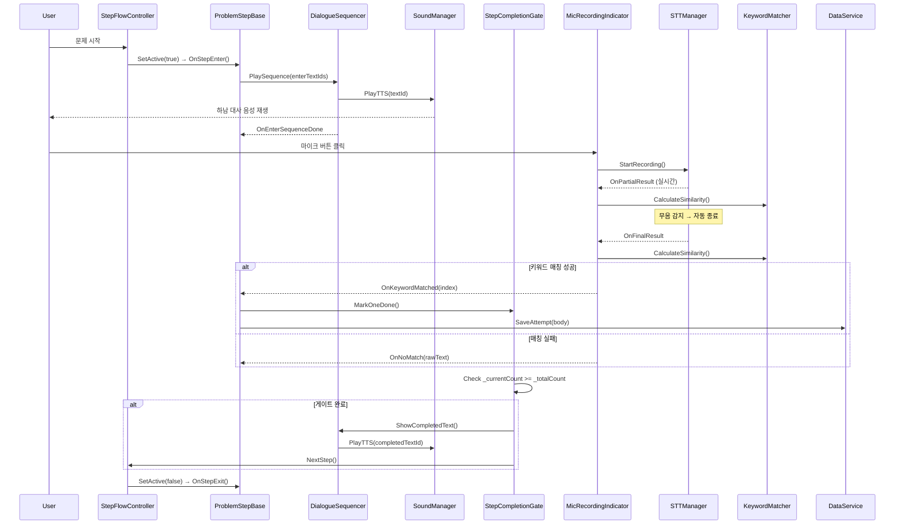
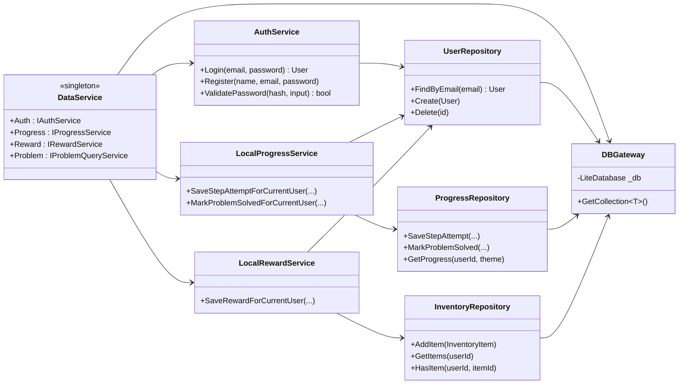

# Hanam_MC
하남시 보건소 산학협력 프로젝트 - 정신건강 앱 클라이언트 개발

## Collaboration
This project was conducted as an industry–academia collaboration between
the Graduate School of Virtual Convergence, Sogang University and MENINBLOX,
and was developed for Hanam Mental Health Welfare Center.

---

## 시스템 아키텍처

### 전체 구조 (Class Diagram)

```mermaid
classDiagram
    direction TB

    %% ===== Singletons (App Lifecycle) =====
    class GameManager {
        <<singleton>>
        +GoToHome()
        +GoToScene(ScreenId)
        +Logout()
        +QuitApplication()
    }

    class SessionManager {
        <<singleton>>
        -User _currentUser
        -string SessionId
        +SignIn(User, sessionId)
        +SignOut()
        +TryRestore() bool
        +event OnChanged
    }

    class DataService {
        <<singleton>>
        +IAuthService Auth
        +IProgressService Progress
        +IRewardService Reward
        +IProblemQueryService Problem
        -DBGateway Db
    }

    class SoundManager {
        <<singleton>>
        -AudioSource[] ttsPlayers
        -AudioSource bgmPlayer
        -AudioSource sfxPlayer
        -Dictionary~int,AudioClip~ _ttsClipsByTextId
        +PlayTTS(int textId)
        +StopTTS()
        +PlayBGM(string clipName)
        +PlaySFX(string clipName)
        +bool IsTTSPlaying
    }

    class ProblemRuntime {
        <<singleton>>
        -LocalizedTable Localized
        +L(int textId)$ string
        +LK(int textId)$ string
        +LE(int textId)$ string
    }

    %% ===== Problem Scene Flow =====
    class ProblemSession {
        <<static>>
        +ProblemTheme CurrentTheme$
        +int CurrentProblemIndex$
        +string CurrentProblemId$
        +bool DemoMode$
    }

    class StepFlowController {
        -List~GameObject~ stepPanels
        -int _currentIndex
        -string bgmClipName
        +NextStep()
        +PrevStep()
        +GoToStep(int index)
        +RestartCurrentStep()
        +ProblemEnd()
    }

    class StepCompletionGate {
        -int _totalCount
        -int _currentCount
        -Image progressFillImage
        -GameObject completeRoot
        +ResetGate(int total)
        +MarkOneDone()
        +MarkOneUndone()
    }

    class DialogueSequencer {
        -int[] enterTextIds
        -int[] completedTextIds
        -Text dialogueText
        -Button nextDialogueBtn
        -Button nextStepBtn
        +PlaySequence(int[] ids, Action, Action)
        +ShowCompletedText()
        +SetText(int textId)
        +event OnEnterSequenceDone
        +event OnEnterComplete
    }

    %% ===== Step Base Hierarchy =====
    class ProblemStepBase {
        <<abstract>>
        #ProblemContext context
        #StepKeyConfig stepKeyConfig
        +OnStepEnter()*
        +OnStepExit()
        #SaveAttempt(object body)
        #SaveReward(object body, itemId, itemName)
    }

    class MultipleChoiceStepBase~T~ {
        <<abstract>>
        #StepCompletionGate completionGate
        +QuestionCount* int
        +GetQuestion(int)* T
        +GetCorrectOptionIndex(T)* int
    }

    class RandomCardSequenceStepBase {
        <<abstract>>
        #StepCompletionGate completionGate
        #Text progressLabel
        +CardCount* int
        +OnApplyCardToUI()*
        +OnAllCardsProcessed()*
    }

    class InventoryDropTargetStepBase {
        <<abstract>>
        -string requiredItemId
        +TargetVisualRoot* GameObject
        +CompletionGate* StepCompletionGate
    }

    class CommonRewardStep {
        -SequenceItem[] sequenceItems
        -DialogueSequencer dialogueSequencer
        -Button homeButton
    }

    class Director_Problem_Logic {
        <<abstract>>
        구체 로직 구현
    }

    class Director_Problem_Binder {
        SerializeField 바인딩
        UI 참조 주입
    }

    %% ===== STT System =====
    class STTManager {
        <<singleton>>
        -IntPtr _ctx
        -AudioClip _micClip
        -List~float~ _recordedSamples
        +StartRecording()
        +StopRecording(bool skipProcessing)
        +GetCurrentVolume() float
        +SetPromptHint(string[])
        +event OnPartialResult
        +event OnFinalResult
    }

    class MicRecordingIndicator {
        -Image targetImage
        -Sprite idleSprite
        -Sprite recordingSprite
        -Sprite recognizingSprite
        -string[] keywords
        +ToggleRecording()
        +SetKeywords(string[])
        +event OnKeywordMatched
        +event OnNoMatch
        +event OnRecordingChanged
    }

    class KeywordMatcher {
        <<static>>
        +CalculateSimilarity(text, keyword)$ float
        +FindBestMatch(text, keywords)$ tuple
        +ContainsKeyword(text, keyword)$ bool
    }

    %% ===== Data Layer =====
    class DBGateway {
        -LiteDatabase _db
        +GetCollection~T~()
    }

    class Repository {
        <<interface>>
        IUserRepository
        IProgressRepository
        IInventoryRepository
    }

    class Service {
        <<interface>>
        IAuthService
        IProgressService
        IRewardService
    }

    %% ===== Relationships =====
    GameManager --> SessionManager : uses
    GameManager --> SceneNavigator : navigates

    StepFlowController --> SoundManager : BGM
    StepFlowController --> ProblemSession : reads context
    StepFlowController --> DataService : save progress
    StepFlowController o-- ProblemStepBase : contains steps

    ProblemStepBase <|-- MultipleChoiceStepBase
    ProblemStepBase <|-- RandomCardSequenceStepBase
    ProblemStepBase <|-- InventoryDropTargetStepBase
    ProblemStepBase <|-- CommonRewardStep
    ProblemStepBase <|-- Director_Problem_Logic
    Director_Problem_Logic <|-- Director_Problem_Binder

    ProblemStepBase --> DataService : SaveAttempt
    ProblemStepBase --> ProblemRuntime : L(textId)

    MultipleChoiceStepBase --> StepCompletionGate
    RandomCardSequenceStepBase --> StepCompletionGate
    InventoryDropTargetStepBase --> StepCompletionGate
    StepCompletionGate --> StepFlowController : auto NextStep

    CommonRewardStep --> DialogueSequencer
    DialogueSequencer --> SoundManager : PlayTTS
    DialogueSequencer --> ProblemRuntime : L(textId)

    MicRecordingIndicator --> STTManager : recording
    MicRecordingIndicator --> KeywordMatcher : matching
    STTManager ..> WhisperNative : FFI

    DataService --> DBGateway
    DataService --> Repository
    DataService --> Service
    Repository --> DBGateway
    Service --> Repository
```

### 데이터 흐름 (Sequence Diagram)

### DB 레이어 구조

### 주요 디자인 패턴

| 패턴 | 적용 위치 | 설명 |
|------|----------|------|
| **Singleton** | GameManager, SessionManager, DataService, SoundManager, STTManager, ProblemRuntime | DontDestroyOnLoad 전역 매니저 |
| **Repository** | UserRepo, ProgressRepo, InventoryRepo 등 | DB 접근 추상화 (LiteDB) |
| **Service Layer** | AuthService, ProgressService, RewardService | 비즈니스 로직 분리 |
| **Binder/Logic** | Director_Problem{N}_Step{M}_Logic → Binder | 로직(abstract)과 UI바인딩(concrete) 분리 |
| **Template Method** | ProblemStepBase → 하위 클래스 | OnStepEnter/Exit 훅 패턴 |
| **Observer** | DialogueSequencer, MicRecordingIndicator, StepCompletionGate | C# event 기반 통신 |
| **State** | MicRecordingIndicator (idle/recording/recognizing) | 3상태 시각 피드백 |
