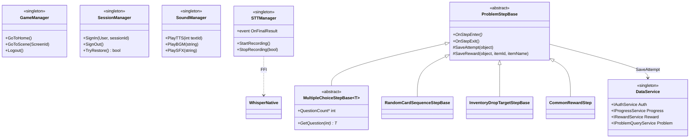
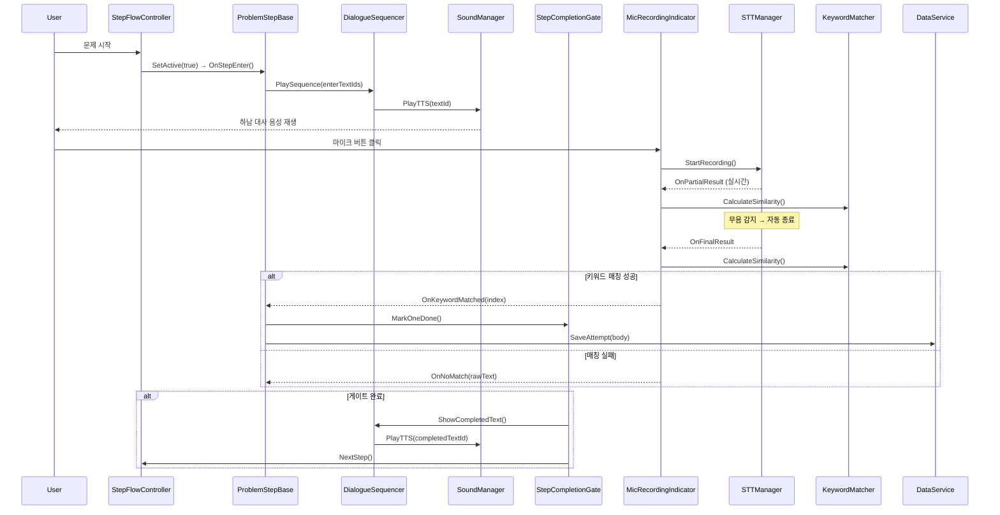
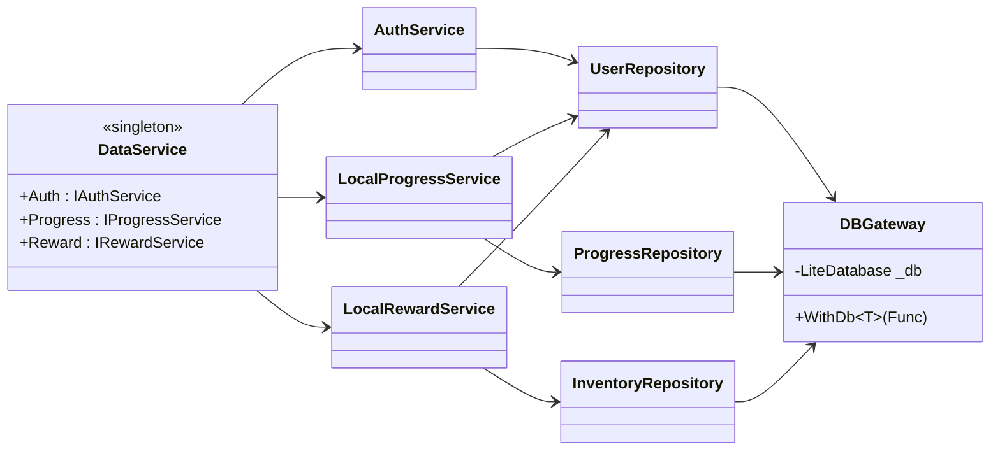

# Hanam_MC — 하남시 정신건강 산학협력 프로젝트
> 하남시 정신건강복지센터 의뢰 · MENINBLOX 주관 · 서강대학교 가상융합대학원 수행의 산학협력 마음건강 교육 앱
>
> 서강대 측 **1인 개발**로 Unity 클라이언트 전 영역(인증·DB·문제풀이·STT·인벤토리)을 단독 구축한 프로젝트입니다.


-yellow)

---

## 📌 At a Glance

| 항목 | 내용 |
|------|------|
| **기간** | 2025.09 ~ 2025.12 (1차 빌드) · 2026.02 ~ 2026.03 (대수정) · **학교 사정으로 중단** |
| **팀 구성** | 산학협력 — **서강대 측 본인 1인 개발** |
| **협력 구조** | 의뢰: 하남시 정신건강복지센터 · 주관: MENINBLOX · 수행: 서강대 가상융합대학원 |
| **본인 역할** | **Unity 클라이언트 전체 개발** (DB, 인증, 문제풀이, STT, 인벤토리, 관리자) |
| **엔진 / 스택** | Unity 6 (6000.0.42f1) + URP 17.0.4 · C# · LiteDB · Whisper.cpp (FFI) · BCrypt |
| **플랫폼** | Windows |
| **규모** | 92+ C# 스크립트, 4계층 아키텍처 |

> 📝 **포트폴리오 의미**
> 완성품은 아니지만 **여기까지의 코드 베이스는 전적으로 본인 1인의 결과물**입니다.
> 외부 기획 전면 변경(2026.02 새 기획자 합류 → 클라이언트 전체 재설계)을 견디는 추상화·계층 분리 설계의 가치를 검증한 사례.

---

## ✨ Highlights

- **4계층 아키텍처** (UI → Service → Repository → DB) 분리 설계 — 추후 서버 연동 전환 시 Repository 구현체만 교체 가능
- **LiteDB 기반 7개 컬렉션** (users, results, attempts, inventory, sessions, problems, feedback) + **역할 기반 인증** (USER / ADMIN / SUPERADMIN)
- **Whisper.cpp 임베디드 STT** (Unity FFI 통합) + Levenshtein 유사도 기반 **KeywordMatcher** — 오프라인 음성 인터랙션
- **Template Method 기반 ProblemStepBase** 계층 (객관식 / 카드 순서 / 드래그앤드롭 / 보상 연출)
- **DialogueSequencer + TTS 다국어 로컬라이즈** — textId 한 개로 텍스트·음성 동시 구동
- **BCrypt(WorkFactor=10) + Result 모노이드** — 비밀번호 해싱과 명시적 에러 흐름

---

## 🤝 Collaboration

This project was conducted as an industry–academia collaboration between
the **Graduate School of Virtual Convergence, Sogang University** and **MENINBLOX**,
and was developed for **Hanam Mental Health Welfare Center**.

서강대 측에서는 본인이 단독으로 Unity 클라이언트 전 영역을 담당하였습니다.

---

## 🗓 Timeline

```
2025.09 ─────────────── 2025.12      1차 빌드 완료 (인증·문제 시스템·관리자 화면)
              ↓
2026.01                              일시 중단
              ↓
2026.02                              MENINBLOX 새 기획자 합류
                                     → 기획 전면 변경 → 클라이언트 전체 재설계
2026.02 ─────────────── 2026.03      대수정 작업 진행
              ↓
                                     학교 사정으로 프로젝트 중단 (미완성)
```

---

## 🏗 Architecture

### 4-Layer Architecture

```
┌─────────────────────────────────────────────────────────────────┐
│                    Presentation Layer                           │
│   LoginFormUI · SignupFormUI · HomeSceneUI · ProblemStepBase    │
├─────────────────────────────────────────────────────────────────┤
│                    Application Layer (Service)                  │
│   AuthService · ProgressService · RewardService · AdminService  │
├─────────────────────────────────────────────────────────────────┤
│                    Data Access Layer (Repository)               │
│   UserRepository · ProgressRepository · InventoryRepository ... │
├─────────────────────────────────────────────────────────────────┤
│                  Infrastructure Layer                           │
│              DBGateway → DBHelper → LiteDB (mc.db)              │
└─────────────────────────────────────────────────────────────────┘
```

### Class Diagram (Singletons + Step Hierarchy)



### Sequence Diagram (문제 풀이 흐름 + STT)



### DB Layer



---

## 🛠 How It Works

### 1. DataService — Singleton Hub & 의존성 조립

`DataService.Awake()`에서 DBGateway → Repository → Service 순으로 직접 조립합니다. Service 간 의존(Reward → Progress)도 명시적으로 주입.

```csharp
void Awake() {
    Instance = this;
    DontDestroyOnLoad(gameObject);

    // 1. Infrastructure
    Db = new DBGateway();
    var dbCore = (IDBGateway)Db;

    // 2. Repository (DBGateway 주입)
    UserRepository      = new UserRepository(dbCore);
    ProgressRepository  = new ProgressRepository(dbCore);
    InventoryRepository = new InventoryRepository(dbCore);
    ResultRepository    = new ResultRepository(dbCore);

    // 3. Service (Repository 주입, Service 간 조합 허용)
    Auth     = new AuthService(UserRepository);
    Progress = new LocalProgressService(
        ProgressRepository, UserRepository, ResultRepository);
    Reward   = new LocalRewardService(
        InventoryRepository, UserRepository, Progress);
}
```

### 2. ProblemStepBase — Template Method

```csharp
public abstract class ProblemStepBase : MonoBehaviour {
    [SerializeField] protected ProblemContext context;
    [SerializeField] protected StepKeyConfig stepKeyConfig;

    public abstract void OnStepEnter();
    public virtual void OnStepExit() { }

    protected void SaveAttempt(object body) {
        var key = stepKeyConfig.BuildKey(
            ProblemSession.CurrentTheme,
            ProblemSession.CurrentProblemIndex);
        DataService.Instance.Progress.SaveStepAttemptForCurrentUser(key, body);
    }

    protected void SaveReward(object body, string itemId, string itemName) {
        DataService.Instance.Reward.SaveRewardForCurrentUser(
            ProblemSession.CurrentTheme,
            ProblemSession.CurrentProblemIndex,
            body, itemId, itemName);
    }
}
```

Step 계층:
- `MultipleChoiceStepBase<T>` — 객관식
- `RandomCardSequenceStepBase` — 카드 순서 맞추기
- `InventoryDropTargetStepBase` — 드래그 앤 드롭
- `CommonRewardStep` — 공통 보상 연출

### 3. Whisper STT + KeywordMatcher

오프라인 STT를 Unity에서 FFI(IntPtr)로 직접 호출하고, 부분 인식(`OnPartialResult`)과 최종(`OnFinalResult`) 결과를 모두 Levenshtein 유사도 매칭에 사용. 발화 변형("마음렌즈", "마음 렌즈")에도 강건.

```csharp
public class MicRecordingIndicator : MonoBehaviour {
    [SerializeField] string[] keywords;
    public event Action<int> OnKeywordMatched;
    public event Action<string> OnNoMatch;

    void HandleFinal(string text) {
        var (bestIdx, score) = KeywordMatcher.FindBestMatch(text, keywords);
        if (score >= 0.6f) OnKeywordMatched?.Invoke(bestIdx);
        else               OnNoMatch?.Invoke(text);
    }
}
```

### 4. Auth — BCrypt + Result Monoid

```csharp
public class AuthService : IAuthService {
    private const int BcryptWorkFactor = 10;

    public Result<User> Login(string email, string password) {
        try {
            var e = AuthValidator.NormalizeEmail(email);
            if (!AuthValidator.IsValidEmail(e))
                return Result<User>.Fail(AuthError.EmailInvalid);

            var u = _users.FindActiveUserByEmail(e);
            if (u == null)
                return Result<User>.Fail(AuthError.NotFoundOrInactive);

            bool ok = BCrypt.Net.BCrypt.Verify(password, u.PasswordHash);
            if (!ok)
                return Result<User>.Fail(AuthError.PasswordMismatch);

            return Result<User>.Success(u);
        }
        catch (Exception ex) {
            Debug.LogError($"[AuthService] Login error: {ex}");
            return Result<User>.Fail(AuthError.Internal);
        }
    }
}
```

역할 기반 라우팅: 로그인 성공 시 USER → HomeScene, ADMIN/SUPERADMIN → ResultScene.

---

## 🧠 Applied Patterns

| 패턴 | 적용 위치 |
|------|----------|
| Singleton | GameManager, SessionManager, DataService, SoundManager, STTManager, ProblemRuntime |
| Repository | UserRepo, ProgressRepo, InventoryRepo 등 LiteDB 추상화 |
| Service Layer | AuthService, ProgressService, RewardService |
| Template Method | ProblemStepBase → 하위 클래스 (OnStepEnter/Exit 훅) |
| Binder / Logic | Director_Problem{N}_Step{M}_Logic(abstract) ↔ Binder(SerializeField) 분리 |
| Observer | DialogueSequencer, MicRecordingIndicator, StepCompletionGate (C# event) |
| State | MicRecordingIndicator의 idle/recording/recognizing 3상태 시각 피드백 |
| Facade | DataService — Auth/Progress/Reward 통합 진입점 |

---

## 📂 Project Structure

```
Hanam_MC/
├── Assets/
│   └── 01. Script/                  # 92+ C# scripts
│       ├── Bootstrap.cs             # 앱 진입점
│       ├── SessionManager.cs        # 세션 상태
│       ├── SceneNavigator.cs        # 씬 전환
│       │
│       ├── Data/                    # 18개 - DataService, DBGateway, Repository, Service
│       ├── Service/                 # 4개 - AuthService, AuthValidator, AdminService
│       │
│       ├── RegisterScene/           # 로그인/회원가입 UI
│       ├── HomeScene/               # 테마/문제 선택
│       ├── ProblemScene/            # 50+ Step 구현 (Director/Gardener)
│       ├── ResultScene/             # 관리자 사용자 브라우저
│       ├── Inventory/               # 보상 인벤토리
│       └── Effect/                  # 애니메이션 효과
│
├── Docs/                            # 개발 로그
├── README.md
├── CODE_FLOW_DETAIL.md              # 코드 흐름 상세
├── CREDITS.md
└── TECHNICAL_REPORT.md              # 92+ 스크립트 상세 분석
```

---

## 💾 Data Model

LiteDB 컬렉션 7개:

| Collection | 모델 | 용도 |
|-----------|------|------|
| `users` | User | 사용자 + Role(USER/ADMIN/SUPERADMIN) + BCrypt 해시 |
| `results` | ResultDoc | 문제 완료 결과 |
| `attempts` | Attempt | 단계별 시도 로그 |
| `inventory` | InventoryItem | 보상 아이템 |
| `sessions` | SessionRecord | 세션 기록 |
| `problems` | Problem | 문제 정보 |
| `feedback` | Feedback | 관리자 피드백 |

DB 파일: `{Application.persistentDataPath}/mc.db`

---

## 🧪 Lessons Learned

- 외부 기획 전면 변경(2026.02 대수정)을 클라이언트가 견디기 위한 **추상화·계층 분리의 실질적 가치** 체감
- Singleton 허브(DataService)를 통한 의존성 조립이 1인 개발에서 변경 비용을 크게 낮춤
- Template Method + Binder/Logic 분리로 다수 Step UI 변형을 안전하게 확장
- FFI 기반 외부 라이브러리(Whisper.cpp) 통합 시 메모리·스레드 수명 관리의 중요성
- 프로젝트 중단이라는 외부 변수에도 코드 자체는 자산으로 남는다는 것을 인지

---

## 🔗 Links

- 📖 **Portfolio**: https://junhyeong7083.github.io/PortFolio/portfolio/hanam-mc
- 📄 `TECHNICAL_REPORT.md` — 92+ 스크립트 / DB 레이어 / 데이터 모델 상세 분석
- 📄 `CODE_FLOW_DETAIL.md` — 코드 흐름 상세 추적
