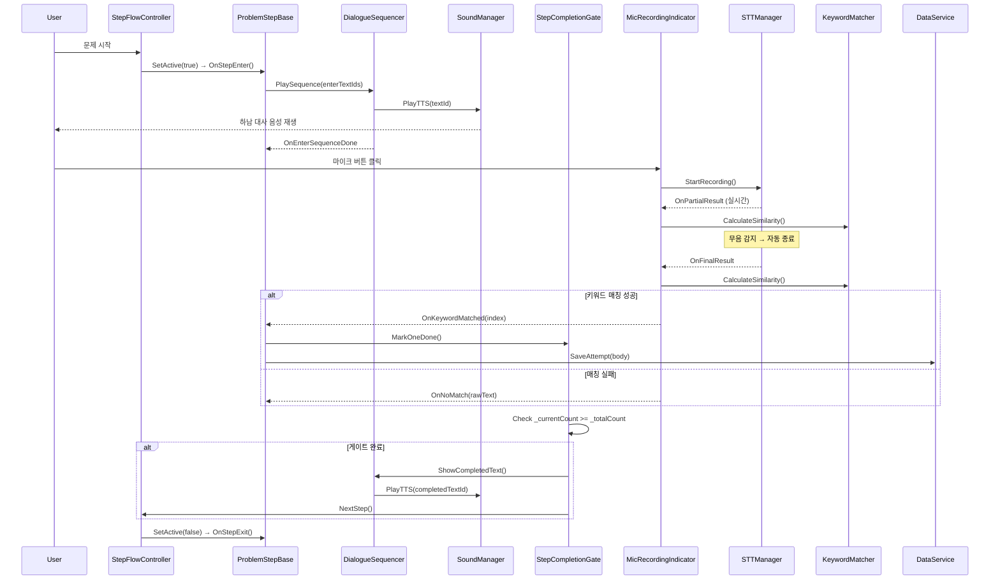
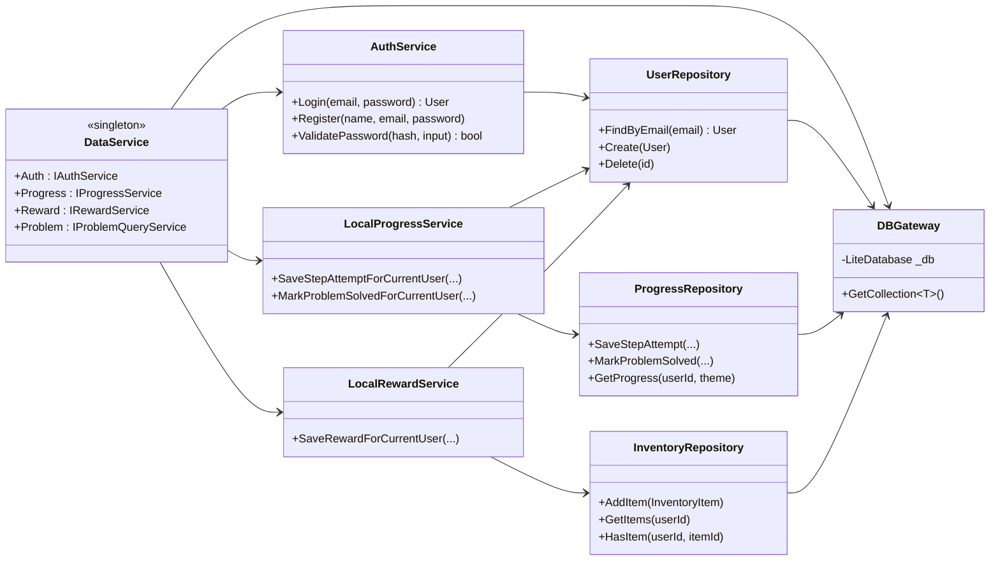

# 마음 필름 감독 (Hanam_MC) - 작업 공수 보고서

> **프로젝트 기간**: 2025-09-19 ~ 2026-03-11 (약 6개월)
> **총 커밋**: 144개 / **세부 작업 항목**: 230+개
> **개발 환경**: Unity (URP 17.0.4), C#, LiteDB, Whisper STT

---

## 프로젝트 타임라인 요약

```
2025-09  ██ Phase 1: 프로젝트 초기 설정
2025-10  ████ Phase 2: 인증/DB 시스템
           ⛔ 중간고사 기간 (10월 중후반)
2025-11  ██████████████ Phase 3~5: 씬 구조 + Problem 1~10 핵심 로직
2025-12  ████████████ Phase 6~9: 이펙트, STT, 리소스, 1차 릴리즈
           ✅ v1.0 완성 (12/18)
2026-01  ████ Phase 10: 음성/사운드 개선
           ⛔ 기획 변경 대기 (1월 말 ~ 2월 중순)
2026-02  ████████ Phase 11~12: 기획 변경 대응 → Problem 전면 재수정
2026-03  ██████████████ Phase 13~16: 시스템 리팩토링 + 최종 QA
```

---

## 1단계: 1차 개발 (2025-09 ~ 12) — v1.0 완성

### Phase 1: 프로젝트 초기 설정 (2025-09-19)

| 커밋 | 작업 내용 | 공수(h) |
|------|----------|---------|
| `525f090` ~ `e6f060b` | GitHub 리포 생성, Unity 프로젝트 초기화, 폴더 구조 설계, NuGet+LiteDB 설치, Form UI 아키텍처 구현 | 5.0 |

**소계: 5.0h**

### Phase 2: 인증/DB 시스템 (2025-10-13 ~ 11-04)

| 커밋 | 작업 내용 | 공수(h) |
|------|----------|---------|
| `33dcda7` UIBinding | UI 바인딩 시스템 구현 | 1.5 |
| `4c7f59c` Login & SignUp | 로그인 + 회원가입 시스템 (BCrypt 암호화) | 4.0 |
| `a5108f6` Bootstrap & SceneId | Bootstrap 씬 로더 + SceneId 체계 설계 | 2.0 |
| `15e25db` SessionManager | 세션 관리 시스템 | 2.0 |
| `362368d` ~ `c65b1b6` | 이름 검색 기능 + 관리자 검색 + 버그 수정 | 3.0 |
| `2a19025` ~ `dcaab17` | 삭제 로직 리팩토링, 이메일 정규화 | 1.5 |
| `492ad30` ~ `065a68d` | 결과 씬 코멘트 패널 개발 → revert → 삭제 이슈 해결 | 4.0 |

**소계: 18.0h** *(⛔ 이후 중간고사 기간)*

### Phase 3: 씬 구조 + DB 리팩토링 (2025-11-19 ~ 11-20)

| 커밋 | 작업 내용 | 공수(h) |
|------|----------|---------|
| `b4a858f` ~ `73fe213` | 관리자/사용자 씬 분리 + 씬 전환 시스템 | 3.5 |
| `3832fda` ~ `d1c5096` | DB 게이트웨이 패턴 2차례 리팩토링 + 레이어 정리 | 3.0 |
| `89a1960` ~ `b85c498` | UX 플로우 수정, UserRepository 정리 | 1.5 |
| `04c6b09` | ProblemSceneController + StepFlowController 신규 개발 | 3.5 |
| `4cc95ee` ~ `ce611e8` | 폰트 자동 변환 에디터, Figma→Unity 파이프라인 설정 | 2.5 |

**소계: 14.0h**

### Phase 4: Problem 1~4 핵심 로직 (2025-11-21 ~ 11-25)

| 커밋 | 작업 내용 | 공수(h) |
|------|----------|---------|
| `6392180` | Problem1 Step1,2 신규 개발 + Effect 기반 + 프리팹 3종 | 5.5 |
| `9e6c3c7` | Problem1 Step3 (STT 연동) | 2.5 |
| `cecd992` | Problem1 Step4 (리워드) | 2.0 |
| `fc67700` ~ `5e2cf96` | Problem1 리팩토링 + DB 스키마 재설계 | 3.0 |
| `5c86807` | Problem2 전체 신규 개발 | 3.0 |
| `2fa680d` ~ `6f3c13d` | 문제 스크립트 구조 리팩토링 + Problem2 개선 | 2.0 |
| `7f98019` | 인게임 인벤토리 시스템 | 2.0 |
| `cb5c84d` | Problem3 Step1,2 + StepCompletionGate 시스템 | 5.0 |
| `bf08b6d` | Problem3 전체 완성 | 2.0 |
| `c9db230` | Problem4 Step1,2 + StepInventoryItem/Panel | 5.0 |
| `aa7420c` | Problem4 Step3,4 | 3.5 |
| `692cb2c` | 전체 문제 스크립트 아키텍처 리팩토링 | 1.5 |

**소계: 37.0h**

### Phase 5: Problem 5~10 핵심 로직 (2025-11-26 ~ 11-28)

| 커밋 | 작업 내용 | 공수(h) |
|------|----------|---------|
| `7d6fae6` | Problem5 전체 신규 개발 | 3.0 |
| `26e5d86` | Problem6 전체 신규 개발 | 3.0 |
| `ca54592` ~ `b2a2826` | DB 레이어 추가 + 리팩토링 + Save DTO | 3.5 |
| `3b7f94d` | Problem7 Step1,2 + Problem8 Step1,2 (4개 스텝 동시) | 7.0 |
| `178c988` | Problem8 전체 완성 | 2.0 |
| `13d78ec` ~ `6171264` | Problem9 + Problem10 신규 개발 | 5.0 |

**소계: 23.5h**

### Phase 6: 이펙트/애니메이션 (2025-12-05 ~ 12-12)

| 커밋 | 작업 내용 | 공수(h) |
|------|----------|---------|
| `f0bfe9e` ~ `6c9c4ef` | Problem2~3 이펙트 시스템 (3개 스텝) | 5.0 |
| `40de4d2` ~ `ed3c837` | Problem3 Step3 + Problem4 전체 이펙트 | 5.0 |
| `eb43f53` | Problem5 이펙트 시스템 | 2.0 |
| `e88165b` ~ `c3e8003` | 가상 키보드 구현 (2차 반복) | 3.5 |
| `c1c91c0` ~ `65ba449` | Problem6,7 이펙트 시스템 | 4.0 |
| `9c1be5f` | Problem8 Step1,2 이펙트 | 2.5 |
| `b252980` ~ `00141ac` | Problem9,10 이펙트 시스템 | 4.0 |
| `6e1d21f` ~ `6d75de1` | 브랜치 머지, README 업데이트 | 0.5 |

**소계: 26.5h**

### Phase 7: STT/음성 시스템 (2025-12-14 ~ 12-16)

| 커밋 | 작업 내용 | 공수(h) |
|------|----------|---------|
| `220712a` | Vosk STT 엔진 통합 + 설정 | 3.0 |
| `b3297ba` | STT 모델 최적화 + 모델 교체 | 1.0 |
| `152e6c4` | STT 인식률 개선 + 버그 수정 | 1.5 |

**소계: 5.5h**

### Phase 8: 리소스 작업 (2025-12-14 ~ 12-17)

| 커밋 | 작업 내용 | 공수(h) |
|------|----------|---------|
| `b99f2be` ~ `8d2c887` | Problem1~8 + 홈씬 이미지/리소스 적용 (9개 커밋) | 10.0 |

**소계: 10.0h**

### Phase 9: 1차 완성 + 릴리즈 (2025-12-17 ~ 12-23)

| 커밋 | 작업 내용 | 공수(h) |
|------|----------|---------|
| `b97047d` | SummaryPanel + RewardPanel 시스템 개발, P9/10 수정, 130+ 리소스, 기술문서 6개 | 10.0 |
| `e121e3c` ~ `dbd470d` | 릴리즈 후 버그 수정 3건 + 프로젝트 문서 | 3.0 |
| `df28749` | **v1.0 최종 빌드 + QA** | 2.0 |
| `5c882e0` ~ `5ceadac` | 홈씬 수정 + 키보드 미러링 | 2.5 |

**소계: 17.5h** ✅ **v1.0 완성**

---

## 2단계: 기능 개선 (2026-01) — 사운드/옵션

### Phase 10: 음성/사운드 개선 (2026-01-09 ~ 01-18)

| 커밋 | 작업 내용 | 공수(h) |
|------|----------|---------|
| `27f7017` | 마이크 입력 버그 수정 | 1.5 |
| `c2c5bb1` | SoundManager 시스템 신규 개발 (BGM/SFX/TTS) | 3.0 |
| `ee2afcd` | GameManager, HomeSceneManager 신규 개발 + 옵션 패널 UI + Mic 수정 + TTSTrigger 리팩토링 | 6.0 |
| `ca0da13` ~ `a25f25a` | 에디터 스크립트(Bold Replacer), Git 재초기화, PR 머지 | 1.5 |
| `9213121` | UI 폰트 전면 교체 + 포지셔닝 + 메뉴 애니메이션 + DOTween 통합 | 5.0 |
| `b28e327` | 회원가입 비밀번호 UX 개선 | 1.5 |

**소계: 18.5h**

> ⛔ **기획 변경 대기 (2026-01 말 ~ 02 중순)**
> 기획자 교체로 인해 전체 컨텐츠 방향 재검토. 약 1개월간 코드 작업 중단.

---

## 3단계: 기획 변경 대응 (2026-02 ~ 03) — 전면 재수정

### Phase 11: DataTable + 대사 시스템 (2026-02-20 ~ 02-26)

| 커밋 | 작업 내용 | 공수(h) |
|------|----------|---------|
| `e251423` | CSV 파싱 유틸리티 + LocalizedTable + RewardTable | 4.0 |
| `0f9343f` | 배경 이미지 전면 교체 (10개 스테이지) | 1.0 |
| `80cdd12` | Bootstrap CSV 로딩 + IntroButtonStyle + IntroStepController | 3.5 |
| `eaafb9f` | 인트로 패널 시스템 | 1.5 |
| `4e6ad25` | Problem1~3 로직 수정 + AutoNextStepButton + HanamBox 프리팹 | 4.0 |
| `bab04dc` | Problem1 Step3 재구현 (기획 변경) | 2.0 |
| `1f9d62a` ~ `875abf2` | AutoSizeByText 개발/개선 + SummaryPanel 수정 | 3.0 |
| `dfb9be6` ~ `a641bd3` | 리소스 정리/교체 | 0.5 |
| `ceb2232` | Problem1 Step4 수정 | 1.5 |
| `2aa990d` | SummaryPanel 수정 + 프리팹 정비 + Stage2 이미지 30개 | 3.5 |
| `5cd39f3` | Problem2 Intro/Step1 + Mic + Problem3 바인더 수정 | 2.5 |

**소계: 27.0h**

### Phase 12: Problem 전면 수정 (2026-02-27 ~ 03-01)

> 기획 변경으로 인해 **Problem 1~10 전체**를 다시 수정해야 했던 가장 큰 Phase.

| 커밋 | 작업 내용 | 공수(h) |
|------|----------|---------|
| `9bafd68` Fix Problem3 | P1~3 코드 수정 + CommonRewardStep + Stage3/4 이미지 80개 | 8.0 |
| `76831b2` Fix Problem4 | P4~9 Step1 리팩토링 + Stage5~9 이미지 100개 | 7.0 |
| `f2224a5` Fix Problem6 | P1/2/5/6 바인더/로직 수정 + 이펙트 컨트롤러 | 4.0 |
| `7f3d218` Fix ~Problem10 | P7~10 이펙트+바인더/로직 전면 수정 (52파일) | 8.0 |
| `9a49cbc` Fix Resource | 공통 시스템 수정 + CommonUI 이미지 + Noto Sans KR 폰트 | 3.0 |
| `b97c6e0` ~ `67b4711` | HanamBox UI + TTS 버튼 추가 | 2.5 |
| `2b91781` Fix SoundFile | TTS 파일 전면 재정리 (wav→mp3, 244파일) | 2.5 |
| `2e55951` ~ `2c3a51a` | UI 좌표 조정 + SoundManager/TTSTrigger 수정 | 2.5 |
| `6ce564d` Fix Problem1~4 Bug | P1~9 버그 수정 + TTS 파일 180개 재배치 + 공통 시스템 | 6.0 |
| `b9e14f4` Fix ~Problem10 Bug | EndingPosterDisplay 개발 + P2~10 로직 수정 + GenreCard | 5.0 |

**소계: 48.5h** *(기획 변경으로 인한 전면 재작업)*

### Phase 13: UI/대사 시스템 정비 (2026-03-03 ~ 03-04)

| 커밋 | 작업 내용 | 공수(h) |
|------|----------|---------|
| `d06f507` | 대사 박스 UI 좌표 수정 | 0.5 |
| `e416c67` | ButtonHover 개선 + SpriteSwapButton 개발 + P1~10 수정 + Nanum 폰트 8종 + 에디터 3개 | 8.0 |
| `34b655f` | HanamBox 프리팹 전면 수정 | 1.0 |
| `c82ab82` | AutoSizeByText 개선 + P3/6 로직 수정 + 프리팹 정비 | 2.5 |

**소계: 12.0h**

### Phase 14: 대사 시퀀서 리팩토링 (2026-03-08 ~ 03-09)

| 커밋 | 작업 내용 | 공수(h) |
|------|----------|---------|
| `53b7d50` | IntroElement/ShakeTrigger/SweepHighlight 개발 + 에디터 2개 + P1~9 로직 수정 + 셰이더 개발 | 8.0 |
| `eb4ba7d` | SummaryPanel 수정 + P2 Step3 수정 + 프리팹 제작 | 3.0 |
| `9648147` | **DialogueSequencer 시스템 전면 리팩토링** + LocalizedText/StageHeaderText + CSV 매핑 | 6.0 |

**소계: 17.0h**

### Phase 15: 인벤토리 + 스텝 시스템 (2026-03-09)

| 커밋 | 작업 내용 | 공수(h) |
|------|----------|---------|
| `583c047` | StepInventory 시스템 개발 + DialogueSequencer 연동 + P1~10 일괄 수정 + 에디터 + 프리팹 | 7.0 |
| `a1ad166` | StartStep 개발 + P2~9 코드 정리 + 프리팹 3종 | 4.0 |
| `5d5c3fe` | DialogueSequencer + P1/2 수정 + Stage2 이미지 | 3.0 |
| `98108e5` | 레벨 선택 씬 수정 | 1.0 |
| `1111f06` | DialogueSequencer/StepInventory + P1~5 수정 + ProblemStepBase + KeywordMatcher | 6.0 |

**소계: 21.0h**

### Phase 16: 최종 수정 + QA (2026-03-10 ~ 03-11)

| 커밋 | 작업 내용 | 공수(h) |
|------|----------|---------|
| `6d13380` | P7/10 Step2,3 + EndingPanel + RadialBurstEffect + FX 에셋 통합 | 5.0 |
| `c451d1b` | CommonRewardStep/StepFlowController + Step4 프리팹 + TTS 200+파일 재정리 | 5.0 |
| `f8fa130` | LocalizedTable 인코딩 수정 | 1.0 |
| `f20cac7` | DialogueSequencer + DebugShortcutController + P1/2/5 수정 | 4.0 |
| `bb914f8` | 튜토리얼 수정 + TTS 추가 | 1.5 |
| `dede861` | Problem10 마이크 연동 수정 | 1.0 |
| `7ebb43e` | P6 BGM 에러 + EndingPosterDisplay + EndingPanel 프리팹 | 3.0 |
| `0eb35be` | MicRecordingIndicator 펄스 이펙트 + UIMicPulse 셰이더/머티리얼 | 3.5 |
| `28f9091` | ButtonHover 수정 + PulseImg 프리팹 + SFX | 2.0 |
| `85f611a` | StepInventoryItem + Mic/STT 수정 + Stage7 이미지 + CSV v02 + TTS | 4.0 |
| `5e4d1f7` | MicRecordingIndicator/STTManager STT 에러 수정 | 1.5 |

**소계: 31.5h**

---

## 총 집계

| 단계 | Phase | 내용 | 공수(h) |
|------|-------|------|---------|
| **1차 개발** | 1~9 | 프로젝트 설정 → v1.0 릴리즈 | 157.0h |
| **기능 개선** | 10 | 사운드/옵션 시스템 | 18.5h |
| **기획 변경 대응** | 11~16 | 전면 재수정 → 최종 QA | 157.0h |
| | | **총 합계** | **332.5h (약 42일 × 8h)** |

### 주요 포인트

- **v1.0까지 순수 개발**: 157h (Phase 1~9)
- **기획 변경으로 인한 재작업**: 157h (Phase 11~16) — 전체의 **47%**
- 기획 변경 대기 기간 (1월 말~2월 중순) 약 1개월은 개발 공백
- 10월 중후반 시험 기간 공백 포함
- 실 가용 개발 기간은 약 **3.5개월**

---

## 시스템 아키텍처

### 전체 구조 (Class Diagram)

```mermaid
classDiagram
    direction TB

    %% ===== Singletons (App Lifecycle) =====
    class GameManager {
        <<singleton>>
        +GoToHome()
        +GoToScene(ScreenId)
        +Logout()
        +QuitApplication()
    }

    class SessionManager {
        <<singleton>>
        -User _currentUser
        -string SessionId
        +SignIn(User, sessionId)
        +SignOut()
        +TryRestore() bool
        +event OnChanged
    }

    class DataService {
        <<singleton>>
        +IAuthService Auth
        +IProgressService Progress
        +IRewardService Reward
        +IProblemQueryService Problem
        -DBGateway Db
    }

    class SoundManager {
        <<singleton>>
        -AudioSource[] ttsPlayers
        -AudioSource bgmPlayer
        -AudioSource sfxPlayer
        -Dictionary~int,AudioClip~ _ttsClipsByTextId
        +PlayTTS(int textId)
        +StopTTS()
        +PlayBGM(string clipName)
        +PlaySFX(string clipName)
        +bool IsTTSPlaying
    }

    class ProblemRuntime {
        <<singleton>>
        -LocalizedTable Localized
        +L(int textId)$ string
        +LK(int textId)$ string
        +LE(int textId)$ string
    }

    %% ===== Problem Scene Flow =====
    class ProblemSession {
        <<static>>
        +ProblemTheme CurrentTheme$
        +int CurrentProblemIndex$
        +string CurrentProblemId$
        +bool DemoMode$
    }

    class StepFlowController {
        -List~GameObject~ stepPanels
        -int _currentIndex
        -string bgmClipName
        +NextStep()
        +PrevStep()
        +GoToStep(int index)
        +RestartCurrentStep()
        +ProblemEnd()
    }

    class StepCompletionGate {
        -int _totalCount
        -int _currentCount
        -Image progressFillImage
        -GameObject completeRoot
        +ResetGate(int total)
        +MarkOneDone()
        +MarkOneUndone()
    }

    class DialogueSequencer {
        -int[] enterTextIds
        -int[] completedTextIds
        -Text dialogueText
        -Button nextDialogueBtn
        -Button nextStepBtn
        +PlaySequence(int[] ids, Action, Action)
        +ShowCompletedText()
        +SetText(int textId)
        +event OnEnterSequenceDone
        +event OnEnterComplete
    }

    %% ===== Step Base Hierarchy =====
    class ProblemStepBase {
        <<abstract>>
        #ProblemContext context
        #StepKeyConfig stepKeyConfig
        +OnStepEnter()*
        +OnStepExit()
        #SaveAttempt(object body)
        #SaveReward(object body, itemId, itemName)
    }

    class MultipleChoiceStepBase~T~ {
        <<abstract>>
        #StepCompletionGate completionGate
        +QuestionCount* int
        +GetQuestion(int)* T
        +GetCorrectOptionIndex(T)* int
    }

    class RandomCardSequenceStepBase {
        <<abstract>>
        #StepCompletionGate completionGate
        #Text progressLabel
        +CardCount* int
        +OnApplyCardToUI()*
        +OnAllCardsProcessed()*
    }

    class InventoryDropTargetStepBase {
        <<abstract>>
        -string requiredItemId
        +TargetVisualRoot* GameObject
        +CompletionGate* StepCompletionGate
    }

    class CommonRewardStep {
        -SequenceItem[] sequenceItems
        -DialogueSequencer dialogueSequencer
        -Button homeButton
    }

    class Director_Problem_Logic {
        <<abstract>>
        구체 로직 구현
    }

    class Director_Problem_Binder {
        SerializeField 바인딩
        UI 참조 주입
    }

    %% ===== STT System =====
    class STTManager {
        <<singleton>>
        -IntPtr _ctx
        -AudioClip _micClip
        -List~float~ _recordedSamples
        +StartRecording()
        +StopRecording(bool skipProcessing)
        +GetCurrentVolume() float
        +SetPromptHint(string[])
        +event OnPartialResult
        +event OnFinalResult
    }

    class MicRecordingIndicator {
        -Image targetImage
        -Sprite idleSprite
        -Sprite recordingSprite
        -Sprite recognizingSprite
        -string[] keywords
        +ToggleRecording()
        +SetKeywords(string[])
        +event OnKeywordMatched
        +event OnNoMatch
        +event OnRecordingChanged
    }

    class KeywordMatcher {
        <<static>>
        +CalculateSimilarity(text, keyword)$ float
        +FindBestMatch(text, keywords)$ tuple
        +ContainsKeyword(text, keyword)$ bool
    }

    %% ===== Data Layer =====
    class DBGateway {
        -LiteDatabase _db
        +GetCollection~T~()
    }

    class Repository {
        <<interface>>
        IUserRepository
        IProgressRepository
        IInventoryRepository
    }

    class Service {
        <<interface>>
        IAuthService
        IProgressService
        IRewardService
    }

    %% ===== Relationships =====
    GameManager --> SessionManager : uses
    GameManager --> SceneNavigator : navigates

    StepFlowController --> SoundManager : BGM
    StepFlowController --> ProblemSession : reads context
    StepFlowController --> DataService : save progress
    StepFlowController o-- ProblemStepBase : contains steps

    ProblemStepBase <|-- MultipleChoiceStepBase
    ProblemStepBase <|-- RandomCardSequenceStepBase
    ProblemStepBase <|-- InventoryDropTargetStepBase
    ProblemStepBase <|-- CommonRewardStep
    ProblemStepBase <|-- Director_Problem_Logic
    Director_Problem_Logic <|-- Director_Problem_Binder

    ProblemStepBase --> DataService : SaveAttempt
    ProblemStepBase --> ProblemRuntime : L(textId)

    MultipleChoiceStepBase --> StepCompletionGate
    RandomCardSequenceStepBase --> StepCompletionGate
    InventoryDropTargetStepBase --> StepCompletionGate
    StepCompletionGate --> StepFlowController : auto NextStep

    CommonRewardStep --> DialogueSequencer
    DialogueSequencer --> SoundManager : PlayTTS
    DialogueSequencer --> ProblemRuntime : L(textId)

    MicRecordingIndicator --> STTManager : recording
    MicRecordingIndicator --> KeywordMatcher : matching
    STTManager ..> WhisperNative : FFI

    DataService --> DBGateway
    DataService --> Repository
    DataService --> Service
    Repository --> DBGateway
    Service --> Repository
```



### 데이터 흐름 (Sequence Diagram)



### DB 레이어 구조



### 주요 디자인 패턴

| 패턴 | 적용 위치 | 설명 |
|------|----------|------|
| **Singleton** | GameManager, SessionManager, DataService, SoundManager, STTManager, ProblemRuntime | DontDestroyOnLoad 전역 매니저 |
| **Repository** | UserRepo, ProgressRepo, InventoryRepo 등 | DB 접근 추상화 (LiteDB) |
| **Service Layer** | AuthService, ProgressService, RewardService | 비즈니스 로직 분리 |
| **Binder/Logic** | Director_Problem{N}_Step{M}_Logic → Binder | 로직(abstract)과 UI바인딩(concrete) 분리 |
| **Template Method** | ProblemStepBase → 하위 클래스 | OnStepEnter/Exit 훅 패턴 |
| **Observer** | DialogueSequencer, MicRecordingIndicator, StepCompletionGate | C# event 기반 통신 |
| **State** | MicRecordingIndicator (idle/recording/recognizing) | 3상태 시각 피드백 |
